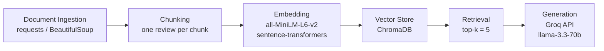

# Project 1 Planning: The Unofficial Guide

> Write this document before you write any pipeline code.
> Your spec and architecture diagram are what you'll use to direct AI tools (Claude, Copilot, etc.) to generate your implementation — the more specific they are, the more useful the generated code will be.
> Update the Retrieval Approach and Chunking Strategy sections if you change your approach during implementation.
> Update this file before starting any stretch features.

---

## Domain

Off Campus Student Housing at Minnesota State University, Mankato
MSU's official housing page lists recommended properties and there is no student reviews, no aggregated ratings, no single place to compare options. Students are left scraping Reddit, asking friends, or going in blind.

---

## Documents

| # | Source | Description | URL or location |
|---|--------|-------------|-----------------|
| 1 | Reddit | Affordable Housing Suggestion | https://www.reddit.com/r/Mankato/comments/gyp9zv/moving_to_mankato_soon_looking_for_an_affordable/|
| 2 | Reddit | Highland Hills Apartments Review| https://www.reddit.com/r/Mankato/comments/1n0s58g/highland_hills_apartments/ |
| 3 | Reddit | The Grove Apartments Review | https://www.reddit.com/r/Mankato/comments/1qf3ngh/the_grove/ |
| 4 | Apartment Ratings | The Summit Apartments Review | https://www.apartmentratings.com/mn/mankato/the-summit_507388254356001/?page=2#ratingsReviews |
| 5 | Google Review |  College Town Apartments Review  | https://www.google.com/search?q=college+town+reviews+mankatoi&oq=college+town+reviews+mankatoi&gs_lcrp=EgZjaHJvbWUyBggAEEUYOTIICAEQABgWGB4yBwgCEAAY7wUyCggDEAAYgAQYogQyCggEEAAYgAQYogQyBwgFEAAY7wXSAQg3ODMzajBqN6gCALACAA&sourceid=chrome&ie=UTF-8#lrd=0x87f439d971ea22df:0x32595010c916a126,1,,,, |
| 6 | Yelp | The Summit Apartments Review | https://www.google.com/url?q=https://www.yelp.com/biz/the-summit-and-jacob-heights-mankato-2?osq%3DApartments%26override_cta%3DRequest%2Binformation&sa=D&source=docs&ust=1780692714431104&usg=AOvVaw13HHdqXB0P1qXIihFrOUoW |
| 7 | Yelp | Affordable Housing Options at MNSU | google.com/url?q=https://www.yelp.com/search?find_desc%3DApartments%26find_loc%3DMankato%252C%2BMN&sa=D&source=docs&ust=1780692747254573&usg=AOvVaw3W6mcZB3ktrDApUFJTfgjg |
| 8 | Google Reviews | College Station Apartments Review | https://www.google.com/search?q=college+station+mankato+reviews&oq=college+station+mankato&gs_lcrp=EgZjaHJvbWUqBggAECMYJzIGCAAQIxgnMhIIARAuGEMYrwEYxwEYgAQYigUyCAgCEAAYFhgeMggIAxAAGBYYHjIICAQQABgWGB4yBwgFEAAY7wUyCggGEAAYgAQYogQyCggHEAAYgAQYogTSAQg3NTM0ajBqN6gCALACAA&sourceid=chrome&ie=UTF-8#lrd=0x87f43a25568092d7:0x25517c9f66a15546,1 |
| 9 | Google Reviews | The Summit Apartments Review | https://www.google.com/search?gs_ssp=eJzj4tZP1zcsyao0MkzJMmC0UjWosDBPMzG2tDBIM021SDFJs7QyqDCztDAxsDRIM0pLMjRKNUnzkiguzc3NLFFIzEtRyEpMzk9SyEjNTM8oKQYAZ6gXrw&q=summit+and+jacob+heights&oq=summit&gs_lcrp=EgZjaHJvbWUqFQgDEC4YJxivARjHARiABBiKBRiOBTIGCAAQRRg8MhMIARAuGIMBGMcBGLEDGNEDGIAEMgYIAhBFGDsyFQgDEC4YJxivARjHARiABBiKBRiOBTIMCAQQABhDGIAEGIoFMgcIBRAAGIAEMgcIBhAuGIAEMgcIBxAAGIAE0gEINDk4MmowajeoAgiwAgHxBYWJdpHG_hls8QWFiXaRxv4ZbA&sourceid=chrome&ie=UTF-8#lrd=0x87f43980f5e8d4f9:0x6984090f2fb12e4f,1 |
| 10 | Google Reviews | Highland Hills Apartments Review | https://www.google.com/search?gs_ssp=eJzj4tZP1zcsMzGLryiyNGC0UjWosDBPMzG2tDC1SDJNS0wxNbUyqDCyMLIwMzVKS0tKSzY3sTDw4svITM_IScxLUcjIzMkpBgCD5RPc&q=highland+hills&oq=highland+hills&gs_lcrp=EgZjaHJvbWUqGAgBEC4YQxivARjHARixAxiABBiKBRiOBTIHCAAQABiPAjIYCAEQLhhDGK8BGMcBGLEDGIAEGIoFGI4FMgYIAhAjGCcyBggDEEUYOzISCAQQABhDGIMBGLEDGIAEGIoFMgcIBRAAGIAEMgcIBhAAGIAEMgcIBxAAGIAEMgcICBAAGIAEMgcICRAAGIAE0gEINjQ5MmowajeoAgCwAgA&sourceid=chrome&ie=UTF-8#lrd=0x87f439858b5fad55:0x2828652ffbfc7480,1 |

---

## Chunking Strategy

Source documents are student housing reviews scraped from Reddit, Google Reviews, Yelp, and 
ApartmentRatings. The vast majority are a single paragraph or less — typically 50–200 words.

**Strategy: one chunk per review, no splitting, no overlap.**

Splitting a 75-word review mid-sentence destroys the only signal it contains. Each review is 
already the atomic unit of meaning.

Metadata per chunk:
- `property_name` — enables filtered retrieval ("Summit reviews only")
- `source` — Reddit, Google, Yelp, ApartmentRatings
- `url` — traceability back to original post
- `date` — management changes make old reviews misleading

**Exception:** If a Reddit thread contains multiple replies, each top-level comment is its own 
chunk — not the whole thread as one.

**Chunk size:** One review per chunk (~50–200 words). No fixed token/character split.

**Overlap:** None. Reviews are atomic — there is nothing meaningful to overlap.

**Reasoning:** Splitting short reviews mid-thought destroys context. A 75-word review is already 
the smallest unit of signal. Forcing arbitrary chunk sizes onto a review corpus optimizes for 
the wrong thing. Exception: multi-reply Reddit threads are split at the comment level, not the 
thread level.

---

## Retrieval Approach

**Embedding model:** `all-MiniLM-L6-v2` via `sentence-transformers`. Fast, lightweight, and 
sufficient for short English-language student reviews.

**Top-k:** 5 chunks per query. Reviews are 50–200 words each, so 5 chunks yields ~500 words 
of context I belive this is enough signal without flooding the prompt with noise.

**Production tradeoff reflection:** For real users, swap to `all-mpnet-base-v2` for higher 
accuracy on nuanced review language, or `text-embedding-3-small` (OpenAI) for better semantic 
precision at low cost. The bigger lever is metadata filtering — pre-filtering by `property_name` 
before vector search improves precision without needing to increase k. Latency is not a concern 
at this corpus size.

---

## Evaluation Plan

| # | Question | Expected answer |
|---|----------|-----------------|
| 1 | What are affordable off-campus housing options close to Minnesota State University, Mankato? | Highland Hills, The Summit, The Grove, College Station, and College Town |
| 2 | What do students say about maintenance at Highland Hills? | Poor — staff shows little regard for tenants, maintenance is slow or never comes, management enters apartments unannounced |
| 3 | What do students say about cleanliness at The Grove? | Reports of dirty and untidy units on move-in |
| 4 | What do students say about The Summit's actual units vs the advertised showrooms? | Showrooms look nice but actual units are noisy, poorly insulated, and dirty on move-in — some report broken appliances and rude management |
| 5 | Is College Station Apartments a good option for students near MNSU? | Mixed — some praise responsive maintenance and great management, others report broken appliances on move-in, inconsistent heating, and noise issues |
| 6 | What do students say about College Town's amenities and management? | Positive reviews for amenities and management responsiveness |

---

## Anticipated Challenges

## Anticipated Challenges

1. **Conflicting reviews producing contradictory answers.** The same property may have 
   positive and negative reviews in the corpus. If both are retrieved for the same query, 
   the LLM may hedge or average them into a useless non-answer instead of surfacing the 
   nuance. Mitigation: prompt the LLM to cite sources and present conflicting views 
   explicitly rather than synthesizing them into one verdict.

2. **Thin corpus leading to undersampling.** With ~30 usable reviews across 6 properties, 
   some properties may have only 1–2 reviews in the vector store. A query about that 
   property retrieves whatever exists — not a representative sample. The system will 
   confidently answer from weak evidence. Mitigation: surface review count per property 
   in the response so users know how much data the answer is based on.

3. **Reviews lack specificity.** Most reviews describe general vibes ("great management," 
   "dirty units") rather than actionable details like pricing, lease terms, or unit 
   conditions. Queries asking for specifics will retrieve vague chunks and generate 
   vague answers. Mitigation: set user expectations in the UI — this system surfaces 
   student sentiment, not property specs.

## Architecture

## AI Tool Plan

**Milestone 3 — Ingestion and chunking:**

**Milestone 4 — Embedding and retrieval:**

**Milestone 5 — Generation and interface:**
